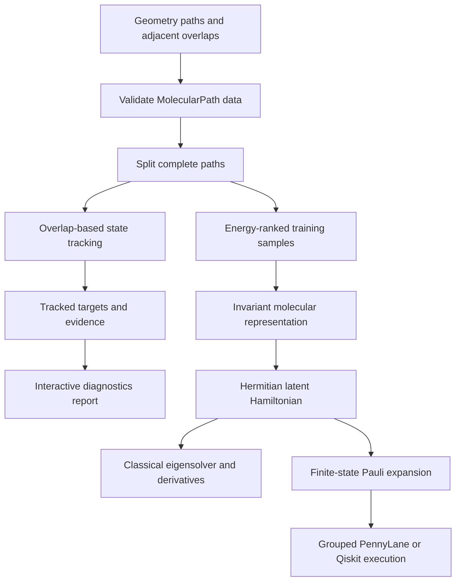

# GeneralDIA

GeneralDIA is a research package for constructing geometry-dependent, finite-state
Hermitian matrices whose eigenvalues and derivatives reproduce selected adiabatic
molecular observables. The model interprets each matrix as a latent diabatic
Hamiltonian.

The package keeps the scientific assumptions visible. You can inspect the molecular
representation, matrix construction, eigendecomposition, Cartesian derivatives, data
adapters, and finite-state qubit encoding without a hidden training framework.

## Scientific question

For atomic numbers $Z$ and nuclear coordinates $R$, GeneralDIA learns

$$
H_\theta(Z,R) \in \mathbb{C}^{N_s\times N_s}.
$$

Diagonalization produces adiabatic energies and states:

$$
H_\theta U = U E, \qquad U^\dagger U=I.
$$

Automatic differentiation then produces energy gradients and the matrix elements

$$
N_{ij}^{A\alpha} =
\left\langle \phi_i \middle|
\frac{\partial H_\theta}{\partial R_{A\alpha}}
\middle| \phi_j \right\rangle.
$$

The training loss can constrain energies, energy gradients, and $N_{ij}$. Each target
adds information about the latent matrix.

## Claim boundary

Energy labels constrain the eigenvalues of $H_\theta$. They do not identify a unique
diabatic Hamiltonian. A geometry-dependent unitary transformation can change the
matrix while preserving its spectrum. Physical interpretation requires more
observables, a documented gauge convention, and validation along connected geometry
paths.

GeneralDIA currently provides a compact pair-distance model for method development.
It does not claim the accuracy or scaling of a modern E(3)-equivariant architecture.

## Processing chain



## Installation

Create and activate a virtual environment, then install the editable package:

```bash
python -m venv .venv
```

Windows PowerShell:

```powershell
.venv\Scripts\Activate.ps1
python -m pip install --upgrade pip
python -m pip install -e ".[dev]"
```

Linux or macOS:

```bash
source .venv/bin/activate
python -m pip install --upgrade pip
python -m pip install -e ".[dev]"
```

Verify the installation:

```bash
pytest
```

Optional integrations:

```bash
python -m pip install -e ".[pyscf]"
python -m pip install -e ".[quantum]"
```

## Five-minute example

```python
import torch

from generaldia import SimpleMolecularHamiltonian, derivative_matrix_elements

torch.set_default_dtype(torch.float64)
torch.manual_seed(7)

# Water geometry. Coordinates use angstrom in this example.
atomic_numbers = torch.tensor([8, 1, 1])
positions = torch.tensor(
    [
        [0.00, 0.00, 0.00],
        [0.96, 0.00, 0.00],
        [-0.24, 0.93, 0.00],
    ]
)

model = SimpleMolecularHamiltonian(n_states=2, hidden=32, n_rbf=12)
energies, eigenvectors, numerators = derivative_matrix_elements(model, atomic_numbers, positions)

print(energies.shape)  # (2,)
print(eigenvectors.shape)  # (2, 2), eigenvectors occupy columns
print(numerators.shape)  # (3, 3, 2, 2): atom, Cartesian axis, state, state
```

The untrained model returns numerical values with the claimed symmetry and tensor
shapes. Train it before interpreting those values as molecular predictions.

## End-to-end experiment

Run the synthetic experiment:

```bash
python examples/05_end_to_end_training.py
```

The script performs these operations:

1. Defines a known two-state Hamiltonian along a diatomic bond coordinate.
2. Calculates reference energies and Cartesian gradients from that Hamiltonian.
3. Stores each geometry and its targets in a validated `MolecularSample`.
4. Splits the geometry path into training, validation, and test partitions.
5. Trains `SimpleMolecularHamiltonian` against energies and gradients.
6. Reports held-out mean absolute errors.
7. Saves weights, loss settings, training history, and experiment metadata.
8. Reloads the checkpoint and checks that its predictions match.

The experiment establishes that the software connects data, training, evaluation,
and persistence. It does not establish chemical accuracy because the targets come
from a synthetic Hamiltonian.

## Path-aware visual diagnostics

Connected scans and trajectories can be stored as `MolecularPath` objects and split
as complete units with `MolecularPathDataset`. State tracking then transforms every
state-indexed target with the same permutation, phase, or subspace rotation used for
the electronic frame.

Run:

```bash
python examples/08_path_aware_diagnostics.py
```

The example checks that no path identifier leaks across train, validation, and test
partitions, tracks a phase-scrambled two-state crossing, and writes a self-contained
interactive report to `outputs/path_tracking_report.html`. The report compares raw
energy rank with tracked state character and exposes the overlap evidence and
thresholds behind every transition.

## Documentation map

- [Getting started](docs/GETTING_STARTED.md): installation and command-by-command checks.
- [End-to-end training](docs/TRAINING_WORKFLOW.md): data, losses, fitting, evaluation, and checkpoints.
- [Data and units](docs/DATA_AND_UNITS.md): tensor shapes and PySCF conversions.
- [Scientific scope](docs/SCIENTIFIC_SCOPE.md): supported conclusions and identifiability limits.
- [Architecture](docs/ARCHITECTURE.md): module boundaries and replacement points.
- [Mathematical conventions](docs/CONVENTIONS.md): eigenvectors, derivative elements, NACs, and Pauli labels.
- [Gauge and state tracking](docs/GAUGE_AND_STATE_TRACKING.md): connected-path overlap
  assignment, degenerate subspaces, covariance, and ambiguity diagnostics.
- [Path-aware workflow](docs/PATH_AWARE_WORKFLOW.md): leakage-resistant splits,
  covariant target construction, and visual evidence reports.
- [Development roadmap](docs/ROADMAP.md): release gates from path-aware supervision
  through learned-Hamiltonian quantum benchmarks.
- [Quantum encoding](docs/QUANTUM_ENCODING.md): finite-state encoding and its scaling.
- [Reproducibility](docs/REPRODUCIBILITY.md): records required for a repeatable experiment.
- [Limitations](docs/LIMITATIONS.md): current model and backend constraints.

## Development checks

```bash
ruff check .
ruff format --check .
pytest --cov=generaldia --cov-report=term-missing
python -m build
python examples/06_state_tracking.py
```

GitHub Actions runs the core suite across supported Python versions and one Windows
job. Separate scheduled jobs exercise PySCF, PennyLane, and Qiskit.

## License

GeneralDIA uses the MIT License. See [LICENSE](LICENSE).
